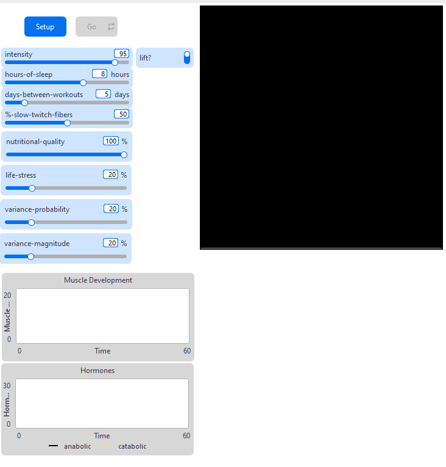
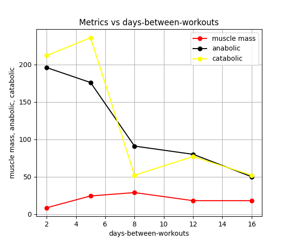

## Комп'ютерні системи імітаційного моделювання
## СПм-24-3, **Олефіренко Михайло Євгенович**
### Лабораторна робота №**2**. Редагування імітаційних моделей у середовищі NetLogo

     

### Варіант 12, модель у середовищі NetLogo:
[Muscle Development](http://www.netlogoweb.org/launch#http://www.netlogoweb.org/assets/modelslib/Sample%20Models/Biology/Muscle%20Development.nlogo). Дослідження факторів, що впливають на зростання м'язів.
>Додати у моделі вплив харчування (умовний регулюємий параметр, наприклад, "якість харчування") на можливість зростання м'язової маси. Додати регулюємі користувачем параметри, що визначають вірогідність та міру тимчасового відхилення від вказаних початкових значень інтенсивності тренувань, кількості годин сну та днів між тренуваннями.

 

### Внесені зміни у вихідну логіку моделі:
**1. Додати параметр "якість харчування", який впливає на ріст м'язової маси.**
Додано елемент управління повзунок з назвою **nutritional-quality** з діапазоном значень від 0 до 100%, який буде впливати на ріст м'язової маси. Значення за замовчуванням - 100%, тобто людина харчується тільки правильно.
Краще всього цей параметр використовувати в процедурі `to grow`, оскільки саме вона відповідає за ріст волокон.
Змінювати будемо рядок, який відповідає за анаболізм, тобто ріст м'язів.

<pre>
to grow  ;; turtle procedure
  ;; catabolic hormones must prepare the fibers for growth before the
  ;; anabolic hormones may add mass to the fibers
  set fiber-size (fiber-size - 0.20 * (log catabolic-hormone 10))
  let growth-factor (0.20 * (nutritional-quality / 100))
  set fiber-size (fiber-size + growth-factor * min (list (log anabolic-hormone 10)
                                                (1.05 * log catabolic-hormone 10)))
end
</pre>

Таким чином, якщо якість харчування буде 100% то м'язи будуть нарощуватися з нормальною швидкістю. Якщо менше 100% то з меншою швидкістю.
Якщо 0%, то взалагі не будуть рости.

**2. Додати параметри, що контролюють вірогідність та міру відхилення для інтенсивності, сну та днів між тренуваннями.**
Додано два нових елементи управління з назвою **variance-probability** з діапазоном значень від 0 до 100%, який впливає на вірогідність відхилення та **variance-magnitude** з діапазоном значень від 0 до 100%, який вказує міру відхилення.
Для роботи над цими параметрами було створено три функції, які повертають фактичне значення у цьому тіку (дні) для інтенсивності, сну та днів між тренуваннями з урахуванням вірогідності та міри відхилення.
<pre>
to-report actual-intensity
  if random-float 100 < variance-probability [
    let deviation-factor (variance-magnitude / 100) * (random-float 2.0 - 1.0)
    report (max list 50 (min list 100 (intensity * (1 + deviation-factor))))
  ]
  report intensity
end

to-report actual-hours-of-sleep
  if random-float 100 < variance-probability [
    let deviation-factor (variance-magnitude / 100) * (random-float 2.0 - 1.0)
    report (max list 1 (min list 12 (hours-of-sleep * (1 + deviation-factor))))
  ]
  report hours-of-sleep
end

to-report actual-days-between-workouts
  if random-float 100 < variance-probability [
    let deviation-factor (variance-magnitude / 100) * (random-float 2.0 - 1.0)
    report (max list 1 (min list 30 (round (days-between-workouts * (1 + deviation-factor)))))
  ]
  report days-between-workouts
end
</pre>

Згідно цих функцій, у коді було змінено їх виклик

Процедура **go:**
<pre>
to go
  ;; note the use of the LOG primitive in the procedures called below
  ;; to simulate a natural system's tendency to adapt less and less
  ;; to each additional unit of some biological substance
  perform-daily-activity
  if lift? and (ticks mod actual-days-between-workouts = 0)
    [ lift-weights ]
  sleep
  regulate-hormones
  develop-muscle
  set muscle-mass sum [fiber-size] of muscle-fibers
  tick
end
</pre>
Процедура **lift-weights:**
<pre>
to lift-weights
  ;; simulate hormonal effect of weight training
  let current-intensity actual-intensity
  ask muscle-fibers [
    if( random-float 1.0 < current-intensity / 100 * current-intensity / 100 ) [
      set anabolic-hormone anabolic-hormone + (log fiber-size 10) * 55
      set catabolic-hormone catabolic-hormone + (log fiber-size 10) * 44
    ]
  ]
end
</pre>
Процедура **sleep**
<pre>
to sleep
  let current-sleep actual-hours-of-sleep
  ;; simulate hormonal effect of sleeping
  ask patches [
    set catabolic-hormone catabolic-hormone - 0.5 * (log catabolic-hormone 10) * current-sleep
    set anabolic-hormone anabolic-hormone - 0.48 * (log anabolic-hormone 10) * current-sleep
  ]
end
</pre>

### Внесені зміни у вихідну логіку моделі, на власний розсуд
**Додати рівень загального стрессу,** зроблено повзунок з назвою **life-stress** з діапазоном 0-100%. У реальному житті важливу роль відіграє життєвий стрес (робота, навчання). Хронічний стрес підвищує базовий рівень катаболічних гормонів, що ускладнює набір маси.
Більше всього під цей параметр підходить процедура **perform-daily-activity**
Додаємо ефект стресу до базового катаболізму:
<pre>
to perform-daily-activity
  ;; simulate hormonal effect of lifestyle
  ;; activities like watching TV and working
  ask muscle-fibers [
    let stress-effect (life-stress / 50)
    set catabolic-hormone catabolic-hormone + 2.0 * (log fiber-size 10) + stress-effect
    set anabolic-hormone anabolic-hormone + 2.5 * (log fiber-size 10)
  ]
end
</pre>
Ця невелика, але постійна добавка до катаболічних гормонів буде симулювати хронічний стрес, ускладнюючи чистий приріст маси.

Фінальний код моделі та її інтерфейс доступні за [посиланням](lb2.nlogox)

## Обчислювальні експерименти
### Початкові умови для експерименту (за замовчуванням)
>intensity = 95, hours-of-sleep = 8, days-between-workouts = 5, %-slow-twitch-fibers = 50, lift?= On, nutritional-quality = 100, life-stress = 20, variance-probability = 20, variance-magnitube = 20, тривалість симуляції = `ticks = 300`

### Вплив частоти тренувань на м'язи
> У цьому експерименті змінюємо лише **один** параметр, решту залишаємо за замовчуванням.

**Мета:** поспостерігати, до чого призведе зміна частоти тренувань: до "застою" або "втрати м'язів".
Параметр, що змінюється `days-between-workouts`

**Таблиця результатів:**
| days-between-workouts | muscle mass | anabolic | catabolic |
|---:|---:|---:|---:|
| 2 | 8.5 | 196 | 212 |
| 5 | 24.3 | 176 | 236 |
| 8 | 28.8 | 91 | 52 |
| 12 | 18 | 80 | 77 |
| 16 | 18 | 50 | 52 |

Судячи з графіку, можна зробити висновок
1. Тренування частіше, ніж кожні 8 днів, призводять до надмірного катаболізму, що не дає м'язам рости.
2. Тренування рідше, ніж кожні 8 днів, призводять до падіння анаболізму нижче рівня, необхідного для підтримки м'язів.
