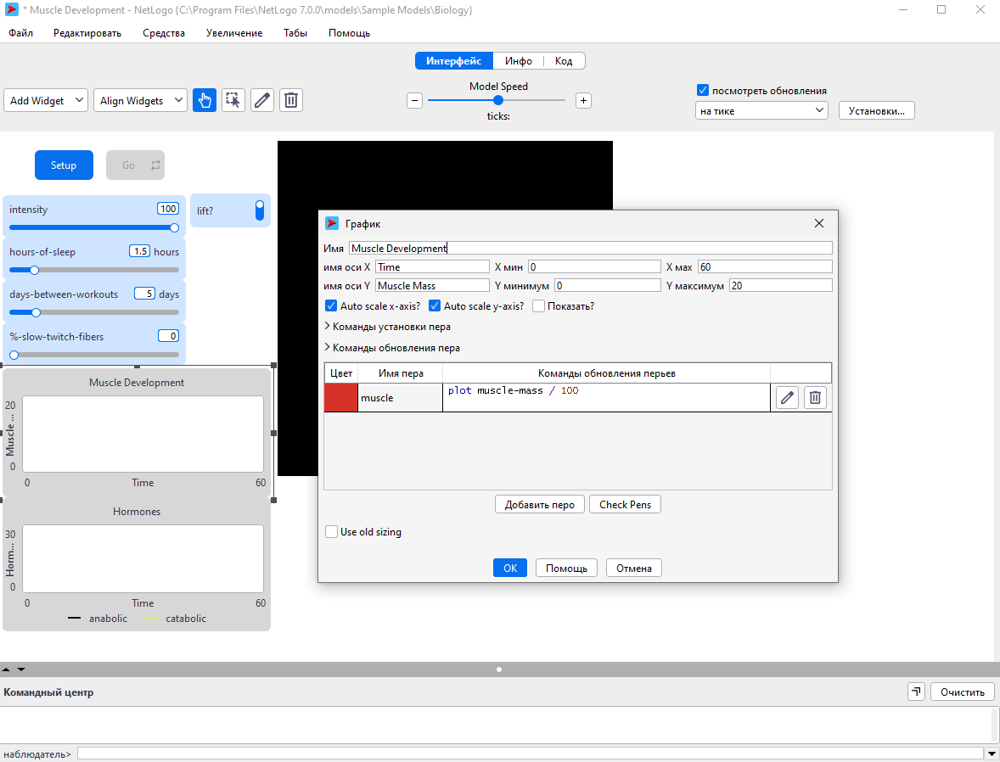
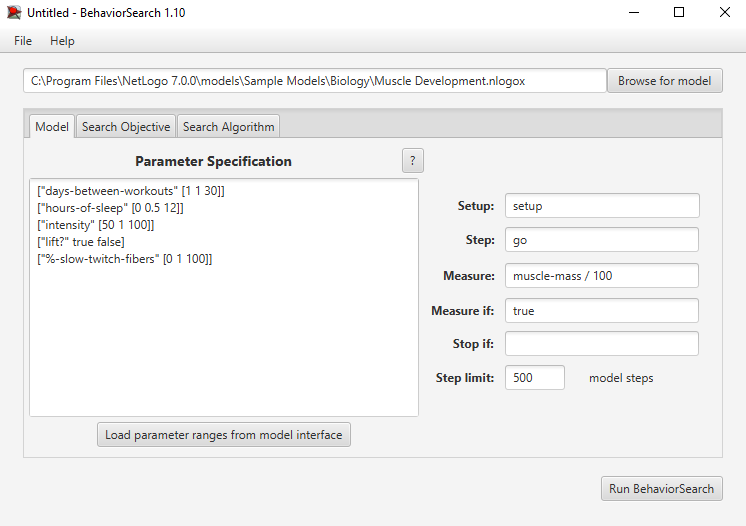
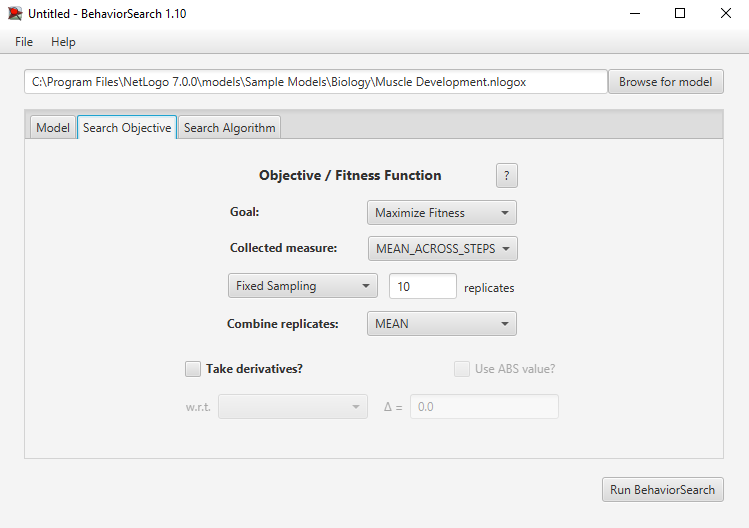
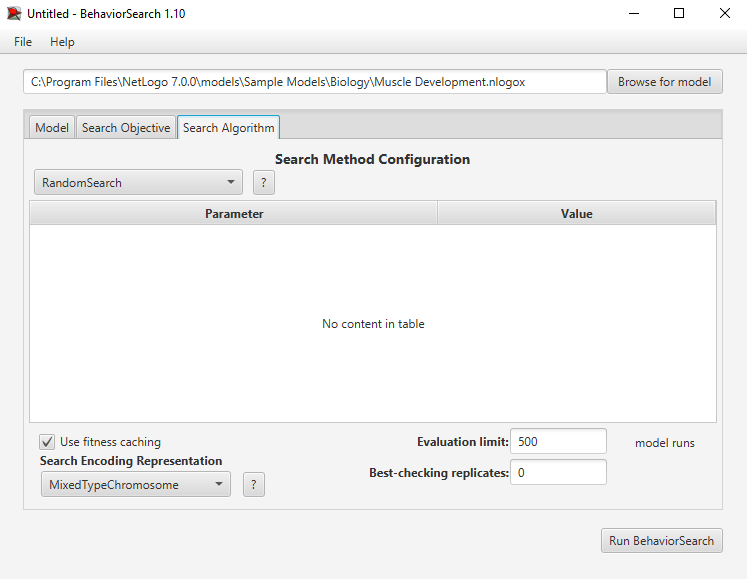
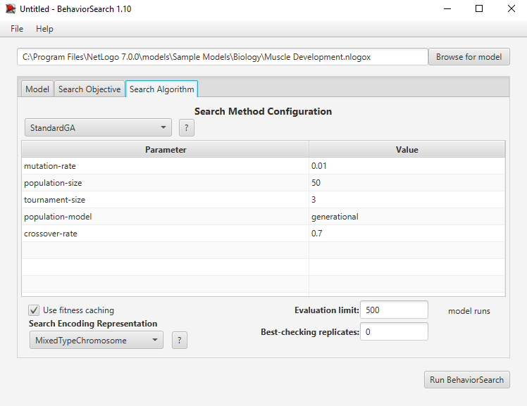
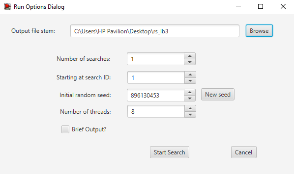
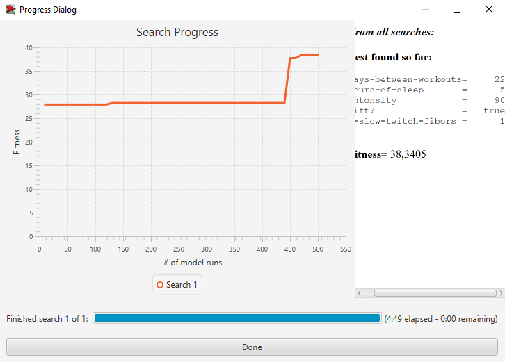
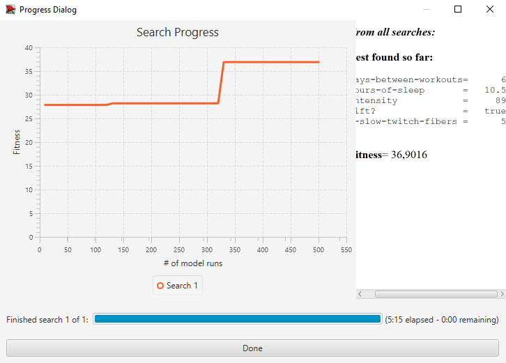
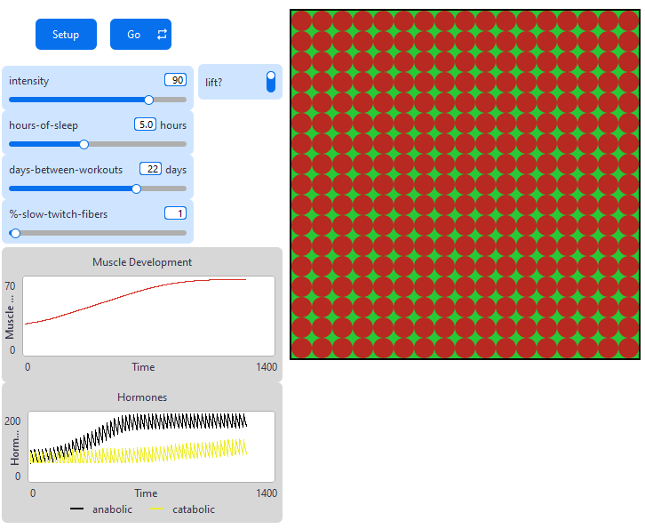
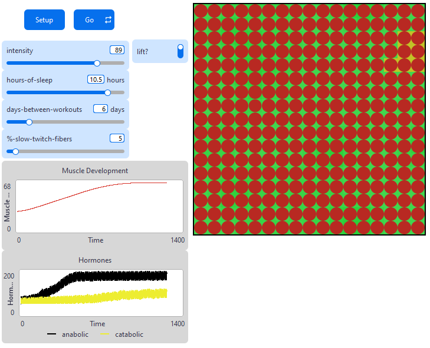

## Комп'ютерні системи імітаційного моделювання
## СПм-24-3, **Олефіренко Михайло Євгенович**
### Лабораторна робота №**3**. Використання засобів обчислювального інтелекту для оптимізації імітаційних моделей

 

### Варіант 12, модель у середовищі NetLogo:
[Muscle Development](http://www.netlogoweb.org/launch#http://www.netlogoweb.org/assets/modelslib/Sample%20Models/Biology/Muscle%20Development.nlogo). Дослідження факторів, що впливають на зростання м'язів.

 

### Вербальний опис моделі:
Модель відтворює взаємодію між м'язовими волокнами які прагнуть рости, та гормонами які стимулюють чи обмежують цей ріст. М'язові волокна нарощують масу під впливом анаболічних гормонів , але спершу повинні бути зруйновані катаболічними гормонами. Гормони виділяються при силових тренуваннях, а їхній рівень регулюється сном та побутовою активністю. Гормони поширюються або розсіюються від місця їхнього виділення між волокнами. Враховуючи генетичний потенціал волокон модель показує, як загальна м'язова маса може збільшуватися, застоюватися або зменшуватися залежно від балансу між інтенсивністю тренувань, частотою та належним відновленням.

### Керуючі параметри:
- **intensity** визначає, наскільки важко атлет тренується. Чим вища інтенсивність, тим більша кількість м'язових волокон буде задіяна і втомлена під час кожного тренування, що призводить до більшого стимулу росту, за умови забезпечення відповідного відновлення.
- **hours-of-sleep** впливає на те, як швидко організм розщеплює гормони. Організм виконує більшу частину свого відновлення під час сну , тому недостатня кількість сну ускладнює набір м'язової маси.
- **days-between-workouts** встановлює частоту тренувань. Впливає на те, скільки часу є в організму для відновлення та побудови сильніших м'язів після останнього тренування.
- **%-slow-twitch-fibers** визначає, яка ймовірність того, що кожне волокно матиме характеристики повільноскорочуваних волокон. Високий відсоток дає високу витривалість, але помірний потенціал для розвитку м'язової маси. Низький відсоток дає низьку витривалість, але значний потенціал для розвитку м'язової маси.
- **lift?** призначений для того, щоб вирішити, чи займається людина в даний момент активно силовими тренуваннями.

### Показники роботи системи:
- Загальна м'язова маса (`muscle-mass`).
- Рівень анаболічних гормонів у системі (`anabolic-hormone`).
- Рівень катаболічних гормонів у системі (`catabolic-hormone`).

 

### Налаштування середовища BehaviorSearch:

**Обрана модель**:
<pre>
C:\Program Files\NetLogo 7.0.0\models\Sample Models\Biology\Muscle Development.nlogox
</pre>
**Параметри моделі** (вкладка Model):  
<pre>
["days-between-workouts" [1 1 30]]
["hours-of-sleep" [0 0.5 12]]
["intensity" [50 1 100]]
["lift?" true false]
["%-slow-twitch-fibers" [0 1 100]]
</pre>
**Використовувана міра:**  
Для фітнес-функції було обрано **значення загальної м'язової маси**, вираз для її розрахунку взято з налаштувань графіка аналізованої імітаційної моделі в середовищі NetLogo  
  
та вказано у параметрі "**Measure**":
<pre>
muscle-mass / 100
</pre>
Значення загальної м'язової маси буде враховуватися за весь період симуляції тривалістю 500 тактів, починаючи з 0 такту симуляції.
Параметри "**Setup**" та "**Go**" вказують відповідні процедури ініціалізації та запуску в логіці моделі.  
Параметр зупинки за умовою не використовувався.

Загальний вигляд вкладки налаштувань параметрів моделі:  

**Налаштування цільової функції** (вкладка Search Objective):  
Метою підбору параметрів імітаційної моделі, що описує фактори, впливаючі на ріст м'язів, є **максимізація** значення значення загальної м'язової маси – це вказано через параметр "**Goal**" зі значенням **Maximize Fitness**. Тобто необхідно визначити такі параметри налаштувань моделі, у яких ріст м'язової маси буде максимальним. При цьому цікавить середнє значення м'язової маси за всю симуляцію тривалістю 500 кроків, задля стійкості та підтримки м'язової маси довгий час. Для цього у параметрі "**Collected measure**", що визначає спосіб обліку значень обраного показника, вказано **MEAN_ACROSS_STEPS**.  
Щоб уникнути викривлення результатів через випадкові значення, що використовуються в логіці самої імітаційної моделі, **кожна симуляція повторюється по 10 разів**, результуюче значення розраховується як **середнє арифметичне**. 

Загальний вигляд вкладки налаштувань цільової функції:  

**Налаштування алгоритму пошуку (вкладка Search Algorithm):**
Спосіб кодування варіанта вирішення - MixedTypeChromosome.
Кількість спроб знаходження кращого параметру для моделі - 500.

Загальний вид вкладки налаштувань алгоритму пошуку RandomSearch:  

Загальний вид вкладки налаштувань алгоритму пошуку StandardGA:

 

### Результати використання BehaviorSearch:
Діалогове вікно запуску пошуку:  

Результат пошуку параметрів імітаційної моделі, використовуючи **випадковий пошук**:  

Результат пошуку параметрів імітаційної моделі, використовуючи **генетичний алгоритм**:  

Виходячи з отриманих результатів, алгоритму пошуку RandomSearch виявився ефективнішим для цієї моделі, оскільки досяг більшого значення фітнесу. Цей алгоритм знайшов кращу комбінацію параметрів, яка максимізує цільову функцію. Також було витрачено менше часу на знахождення правильної комбінації параметрів. Перевагою алгоритму пошуку StandardGA є те, що він знайшов накрайщий результат швидше, судячи з графіку, але цей результат виявився менш оптимальним, ніж кінцевий результат пошуку RandomSearch.

 

### Результат використання отриманих параметрів в моделі NetLogo:
**Випадковий пошук:**

**Генетичний алгоритм:**

